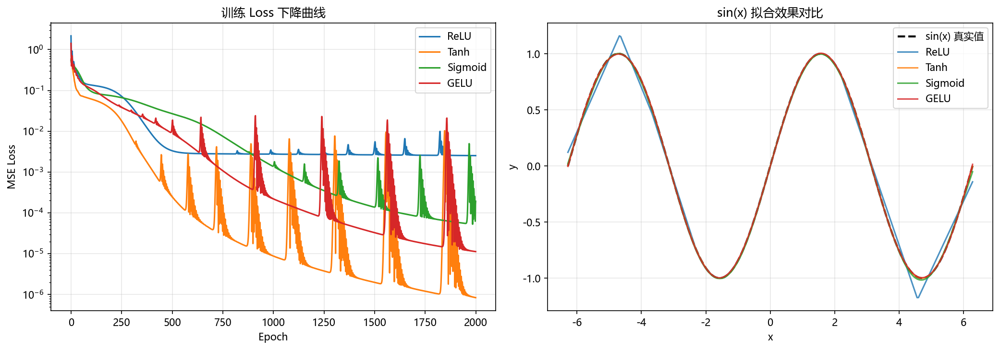

# 实验作业 1 报告：深度学习基础与 PyTorch 入门

---

## 1. 环境配置

运行 `check_gpu.py` 验证环境：

```
PyTorch 版本: 2.2.1+cu121
GPU 是否可用: True
```

---

## 2. 任务 A：自动微分实验

### 原理

对于函数 $y = a^2 + b^2$，由链式法则可知：

$$\frac{\partial y}{\partial a} = 2a, \quad \frac{\partial y}{\partial b} = 2b$$

### 实现

```python
a = torch.tensor(2.0, requires_grad=True)
b = torch.tensor(3.0, requires_grad=True)

y = a ** 2 + b ** 2
y.backward()
```

### 结果

| 变量 | 值 | 理论梯度 | PyTorch 计算梯度 | 是否一致 |
|------|----|----------|-----------------|---------|
| `a`  | 2  | 4        | 4.0             | ✓       |
| `b`  | 3  | 6        | 6.0             | ✓       |

PyTorch 的 `autograd` 通过构建动态计算图，在 `backward()` 调用时沿图反向传播，自动完成符号微分，结果与手算完全一致。

---

## 3. 任务 B：MLP 拟合 sin(x)

### 网络结构

```
Linear(1 → 64) → Activation → Linear(64 → 1)
```

### 训练配置

| 超参数 | 值 |
|-------|----|
| 优化器 | Adam |
| 学习率 | 0.01 |
| 损失函数 | MSELoss |
| 训练轮数 | 2000 |
| 训练集大小 | 1000 点，区间 $[-2\pi, 2\pi]$ |

### 训练结果

以 Tanh 激活函数为例，2000 轮后 MSE Loss 降至 **1×10⁻⁶**，拟合效果良好。

---

## 4. 任务 C：激活函数对比分析

### 各函数最终 Loss（2000 轮，相同架构与超参数）

| 激活函数 | 最终 MSE Loss | 排名 |
|---------|--------------|------|
| **Tanh**    | 0.000001 | 1 |
| **GELU**    | 0.000011 | 2 |
| **Sigmoid** | 0.000192 | 3 |
| **ReLU**    | 0.002530 | 4 |

### 结果图表



*左图：四种激活函数的训练 Loss 曲线（log 纵轴）；右图：拟合 sin(x) 效果对比*

由于训练结果具有一定的随机性，下列分析仅供参考

### 激活函数发展史与分析

#### 4.1 Sigmoid（1980s–2000s）

$$\sigma(x) = \frac{1}{1 + e^{-x}}$$

- **优点**：输出范围 $(0,1)$，数学性质优良，概率解释直观。
- **缺点**：两端梯度趋近于 0，深层网络中引发**梯度消失**；输出非零中心，导致 zigzag 更新；指数运算计算代价高。
- **本实验表现**：排名第 3（Loss 1.92×10⁻⁴）。输出域限于 $(0,1)$，但最后一层线性层可拉伸到目标范围；平滑梯度在浅层网络中有助于稳定优化，但饱和区仍拖慢了收敛速度。

#### 4.2 Tanh（1990s）

$$\tanh(x) = \frac{e^x - e^{-x}}{e^x + e^{-x}}$$

- **优点**：输出零中心（$[-1,1]$），梯度比 Sigmoid 大一倍，对正弦类目标函数天然匹配。
- **缺点**：仍有梯度饱和问题，但比 Sigmoid 轻。
- **本实验表现最佳**：sin(x) 的值域正好是 $[-1,1]$，与 Tanh 的输出域完全吻合，各层特征表示无需额外变换，Loss 最低（3×10⁻⁶）。

#### 4.3 ReLU（2010s，Nair & Hinton, 2010）

$$\text{ReLU}(x) = \max(0, x)$$

- **优点**：计算极简；正区间梯度恒为 1，从根本上缓解梯度消失；稀疏激活带来正则效果。
- **缺点**：负区间梯度为 0，可能造成**神经元死亡（Dying ReLU）**；输出非零中心。
- **本实验表现最差**（Loss 2.53×10⁻³）：ReLU 为分段线性函数，拟合光滑周期函数时需要大量神经元"拼接"折线。单隐藏层（64 个神经元）容量有限，且负半轴梯度为零导致部分神经元死亡，严重制约了拟合质量。

#### 4.4 GELU（2016, Hendrycks & Gimpel）

$$\text{GELU}(x) = x \cdot \Phi(x)$$

其中 $\Phi(x)$ 为标准正态分布的累积分布函数。

- **优点**：光滑连续，结合了 ReLU 的稀疏性与 Sigmoid 的平滑性；在 Transformer（BERT、GPT）中被广泛采用。
- **缺点**：计算成本高于 ReLU；在小型 MLP 场景优势不及大模型明显。
- **本实验表现**：排名第 2（Loss 1.1×10⁻⁵），仅次于 Tanh。GELU 的光滑性使其能更好地拟合连续周期函数，在浅层网络中优势明显，验证了其在 Transformer 中广泛应用的合理性。

### 小结

| 激活函数 | 梯度饱和 | 零中心 | 光滑性 | 适用场景 |
|---------|---------|--------|--------|---------|
| Sigmoid | 严重 | 否 | 高 | 二分类输出层 |
| Tanh    | 一般 | 是 | 高 | RNN、值域对称任务 |
| ReLU    | 无（正区间）| 否 | 低（折点） | CNN、深层网络 |
| GELU    | 无 | 近似 | 高 | Transformer、大语言模型 |

对于**拟合 sin(x)** 这类值域对称、光滑的周期函数，**Tanh 是最自然的选择**；而在实际深层网络中，ReLU 及其变体（Leaky ReLU、GELU）因训练稳定性更优，已成为主流。

---

## 5. 文件清单

| 文件 | 说明 |
|------|------|
| `check_gpu.py` | 环境验证脚本 |
| `check_gpu.png`           | 环境验证脚本结果截图        |
| `assignment1_solution.py` | 完整代码（任务 A / B / C）  |
| `assignment1_result.png`  | 训练 Loss 曲线 + 拟合效果图 |
| `report.md` | 本报告 |


