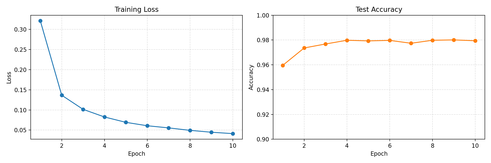

# 实验作业 2 报告：基于 MLP 的手写数字识别

---

## 1. 实验目标

本次作业基于 PyTorch 实现一个手写数字识别系统，分为两个部分：

1. 训练一个基于 MLP 的 MNIST 分类模型。
2. 开发一个 GUI 程序，支持手写输入、实时预测和各类别置信度展示。

按照题目要求，模型需满足以下关键条件：

- 自动下载并加载 MNIST 数据集
- 至少包含 2 个隐藏层
- 使用 ReLU 激活函数
- 使用交叉熵损失函数和 Adam 优化器
- 支持 GPU 自动加速
- 测试集准确率达到 97% 以上

---

## 2. 实验环境

本实验在本机 Python 环境中完成，核心依赖如下：

| 项目 | 信息 |
|------|------|
| Python | 3.11.7 |
| PyTorch | 2.2.1+cu121 |
| torchvision | 0.17.1+cu121 |
| matplotlib | 3.10.7 |
| Pillow | 11.0.0 |
| CUDA | 可用 |

训练脚本会自动检测硬件环境：

```python
device = torch.device("cuda" if torch.cuda.is_available() else "cpu")
```

本次训练实际运行在 `cuda` 设备上。

---

## 3. 任务一：模型训练

### 3.1 数据准备

训练脚本 `train.py` 使用 `torchvision.datasets.MNIST` 自动下载并加载数据集，下载路径已调整为脚本所在目录下的 `data/`：

```python
OUTPUT_DIR = Path(__file__).resolve().parent
DATA_DIR = OUTPUT_DIR / "data"
train_dataset = datasets.MNIST(root=DATA_DIR, train=True, download=True, transform=transform)
test_dataset = datasets.MNIST(root=DATA_DIR, train=False, download=True, transform=transform)
```

数据预处理流程如下：

1. 使用 `ToTensor()` 将图像转换为张量
2. 使用 `Normalize((0.1307,), (0.3081,))` 做标准化

其中 `0.1307` 和 `0.3081` 是 MNIST 常用的均值和标准差。

### 3.2 模型结构

本实验构建的 MLP 模型包含 2 个隐藏层，并在隐藏层后加入 Dropout 以减轻过拟合：

```python
nn.Sequential(
    nn.Flatten(),
    nn.Linear(28 * 28, 256),
    nn.ReLU(),
    nn.Dropout(0.2),
    nn.Linear(256, 128),
    nn.ReLU(),
    nn.Dropout(0.2),
    nn.Linear(128, 10),
)
```

模型特点：

- 输入层：`28 x 28 = 784` 维
- 隐藏层 1：256 个神经元，ReLU 激活
- 隐藏层 2：128 个神经元，ReLU 激活
- 输出层：10 类，对应数字 `0-9`
- Dropout：两处 `p=0.2`

### 3.3 训练配置

训练脚本中的主要超参数如下：

| 超参数 | 取值 |
|------|------|
| Epochs | 10 |
| Batch Size | 128 |
| Learning Rate | 0.001 |
| Optimizer | Adam |
| Loss Function | CrossEntropyLoss |
| Random Seed | 42 |

由于当前 Windows 沙箱环境对多进程数据加载有限制，`DataLoader` 设置为单进程：

```python
worker_count = 0
```

该设置不会影响模型正确性，只会略微影响数据加载速度。

### 3.4 训练结果

实际训练日志如下：

```text
Epoch 01/10 | train_loss=0.3213 | test_loss=0.1304 | test_acc=95.96%
Epoch 02/10 | train_loss=0.1366 | test_loss=0.0866 | test_acc=97.36%
Epoch 03/10 | train_loss=0.1015 | test_loss=0.0778 | test_acc=97.68%
Epoch 04/10 | train_loss=0.0825 | test_loss=0.0674 | test_acc=97.98%
Epoch 05/10 | train_loss=0.0692 | test_loss=0.0675 | test_acc=97.93%
Epoch 06/10 | train_loss=0.0608 | test_loss=0.0644 | test_acc=97.97%
Epoch 07/10 | train_loss=0.0554 | test_loss=0.0732 | test_acc=97.74%
Epoch 08/10 | train_loss=0.0493 | test_loss=0.0681 | test_acc=97.98%
Epoch 09/10 | train_loss=0.0446 | test_loss=0.0683 | test_acc=98.01%
Epoch 10/10 | train_loss=0.0412 | test_loss=0.0732 | test_acc=97.94%
```

最佳测试集准确率为：

```text
98.01%
```

达到并超过题目要求的 `97%`。

### 3.5 训练曲线

训练过程中已保存损失曲线与测试准确率曲线图：



从曲线可以看出：

- 训练损失整体稳定下降
- 测试准确率在第 2 个 epoch 后已超过 97%
- 后续精度在 97.7% 到 98.0% 附近波动，说明模型已基本收敛

### 3.6 模型保存

脚本会在测试准确率提升时保存最佳模型，输出文件为：

```text
mnist_mlp.pth
```

保存内容包括：

- `model_state_dict`
- `test_accuracy`
- `epochs`

---

## 4. 任务二：GUI 手写识别

### 4.1 功能实现

`gui.py` 实现了题目要求的全部核心功能：

1. 提供手写画布，支持鼠标绘制数字
2. 自动加载训练好的 `mnist_mlp.pth`
3. 将手写内容预处理后输入模型进行识别
4. 显示预测结果及其置信度
5. 以条形图方式展示 0-9 各类别概率
6. 提供清空按钮，方便多次测试

### 4.2 GUI 预处理流程

为了让手写输入尽可能接近 MNIST 分布，GUI 中做了如下预处理：

1. 将白底黑字图像反色处理
2. 提取数字的外接框
3. 将数字缩放到 `20 x 20`
4. 粘贴到 `28 x 28` 的黑底画布中央
5. 转为张量并按训练阶段相同的均值和方差标准化

这样可以保证 GUI 推理阶段的输入分布与训练阶段尽量一致。

### 4.3 结果展示

GUI 支持自动预测和置信度显示，右侧柱状图会展示数字 `0-9` 的预测概率分布。  
在本地测试中，已经保存了数字 `0-9` 的界面截图，位于 `predict/` 目录下：

- `predict/0.png`
- `predict/1.png`
- `predict/2.png`
- `predict/3.png`
- `predict/4.png`
- `predict/5.png`
- `predict/6.png`
- `predict/7.png`
- `predict/8.png`
- `predict/9.png`

这些图片可作为 GUI 功能验证材料提交。

---

## 5. 代码实现说明

### 5.1 `train.py`

训练脚本完成了以下职责：

- 自动下载并加载 MNIST
- 构建 MLP 模型
- 自动切换 CPU / GPU
- 执行训练与测试评估
- 保存最佳模型
- 输出训练曲线图

### 5.2 `gui.py`

GUI 脚本完成了以下职责：

- 创建手写画布
- 读取训练后的模型参数
- 对用户输入进行预处理
- 执行推理并输出类别概率
- 支持清空画板和重复测试

---

## 6. 思考题

### 6.1 Dropout 的具体形式是什么？作用是什么？

Dropout 是一种常见的正则化方法。在训练过程中，它会以一定概率随机将部分神经元输出置零，从而使模型不能过度依赖某些局部特征，迫使网络学习更鲁棒的表示。

以本实验中的 `Dropout(0.2)` 为例，其含义是：

- 训练阶段：每次前向传播随机丢弃约 20% 的神经元输出
- 测试阶段：Dropout 自动关闭，使用完整网络进行推理

Dropout 的主要作用：

1. 抑制过拟合
2. 提高模型泛化能力
3. 降低神经元之间的共适应

本实验在两个隐藏层后均使用了 `Dropout(0.2)`，这有助于在保持较高准确率的同时提升模型稳定性。

### 6.2 Dropout 在现代 LLM、生成式模型中是否还在使用？为什么？

仍然会使用，但使用方式和早期 MLP/CNN 时代有所不同。

原因如下：

1. 对于传统的小中型网络，Dropout 仍然是有效的正则化手段。
2. 在现代 Transformer、LLM 和生成式模型中，训练数据规模更大、参数更多，常常更依赖以下手段控制泛化与稳定性：
   - 大规模数据训练
   - 权重衰减
   - LayerNorm / RMSNorm
   - 残差结构
   - 更稳定的优化策略
3. 因此，在很多大模型实现中，Dropout 的比例会较小，甚至在部分训练配置中关闭，以避免影响收敛效率。

也就是说，Dropout 并没有完全消失，但它已经不再是现代大模型中最核心的正则化技术。

---

## 7. 作业完成情况

本次作业已完成以下内容：

| 文件 | 说明 |
|------|------|
| `train.py` | MLP 训练脚本 |
| `gui.py` | 手写数字识别 GUI |
| `mnist_mlp.pth` | 训练得到的最佳模型参数 |
| `training_curves.png` | 训练损失与测试精度曲线 |
| `predict/0.png` ~ `predict/9.png` | GUI 测试截图 |
| `report.md` | 本实验报告 |

---

## 8. 总结

本实验完整实现了一个基于 MLP 的手写数字识别系统。训练阶段通过两层隐藏层的 MLP、ReLU 激活、Adam 优化器和 Dropout 正则化，在 MNIST 测试集上达到了 `98.01%` 的准确率，超过作业要求。GUI 部分实现了手写输入、自动预测和类别置信度展示，形成了从模型训练到交互式推理的完整闭环。

从实验结果来看，虽然 MLP 结构相对简单，但在 MNIST 这类标准数据集上仍能取得较高准确率。通过本次实验，可以较完整地理解深度学习任务中的数据处理、模型设计、训练评估、模型保存与实际部署流程。
