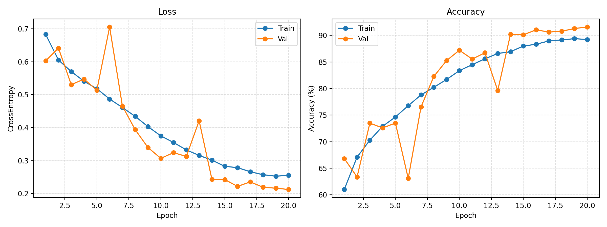
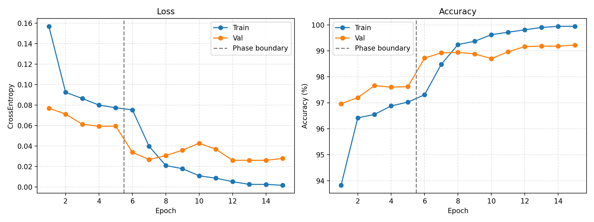
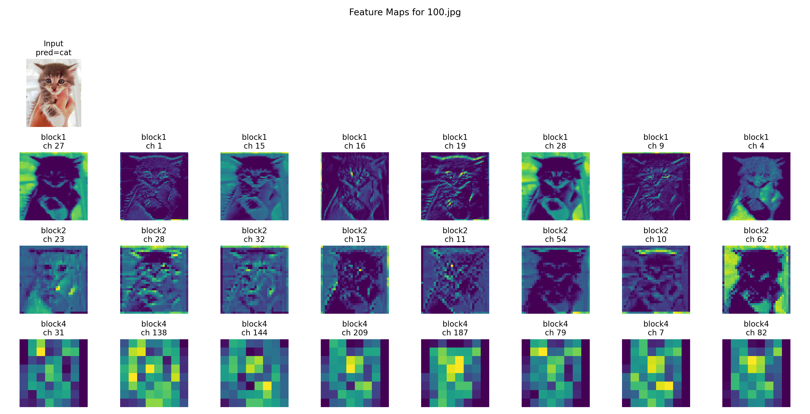

# 实验作业 3 报告：卷积神经网络（CNN）与猫狗图像分类

---

## 1. 实验目标

本次作业围绕 Dogs vs. Cats 数据集完成两个核心任务：

1. 任务一：从零搭建并训练一个 CNN，理解卷积、BatchNorm、池化、数据增强和学习率调度等基础组件。
2. 任务二：基于预训练 ResNet18 进行两阶段迁移学习，比较迁移学习与从零训练在收敛速度和精度上的差异。

其中，任务一和任务二均已完成正式训练，相关结果已填入本报告。

---

## 2. 实验环境

本实验在本地 Windows + CUDA 环境下完成，核心依赖如下：

| 项目 | 信息 |
|------|------|
| Python | 3.11 |
| PyTorch | 2.2.1+cu121 |
| torchvision | 0.17.1+cu121 |
| matplotlib | 已安装 |
| Pillow | 已安装 |
| CUDA | 可用 |
| 实际训练设备 | `cuda` |

代码中通过以下方式自动选择运行设备：

```python
device = torch.device("cuda" if torch.cuda.is_available() else "cpu")
```

在当前环境下，GPU 可正常使用，因此完整训练均运行在 CUDA 设备上。

---

## 3. 数据集与预处理

### 3.1 数据集来源

本次实验使用的数据集路径为：

```text
data/kagglecatsanddogs_5340/PetImages
```

数据集中原始包含：

- 猫图像 12,500 张
- 狗图像 12,500 张

在数据扫描阶段，程序自动过滤损坏图像。实际可用样本数为：

| 类别 | 数量 |
|------|------|
| Cat | 12,499 |
| Dog | 12,499 |
| 合计 | 24,998 |

损坏图像共 2 张，已在训练前自动跳过。

### 3.2 数据划分

按照题目要求，数据集按 `80 / 20` 比例划分：

| 集合 | 数量 |
|------|------|
| 训练集 | 19,998 |
| 验证集 | 5,000 |

### 3.3 图像变换

任务一和任务二都使用了训练增强与验证预处理分离的策略。

训练阶段主要增强包括：

- `Resize`
- `RandomHorizontalFlip`
- `RandomRotation`
- `ColorJitter`
- `Normalize`

验证阶段只保留：

- `Resize`
- `Normalize`

这样的设置可以在训练时增加样本多样性，而在验证时保持评估标准一致。

---

## 4. 任务一：从零搭建 CNN

### 4.1 实现思路

任务一对应脚本为 `train_scratch.py`，主要实现了以下内容：

1. 自定义猫狗数据集类，从文件路径或父目录自动解析类别标签。
2. 对训练集使用随机翻转、随机旋转、颜色扰动等数据增强。
3. 构建卷积神经网络 `SimpleCNN`。
4. 对卷积层、BatchNorm 和全连接层使用 Kaiming/常数初始化。
5. 使用 Adam 优化器和 `CosineAnnealingLR` 学习率调度器进行训练。
6. 在 CUDA 可用时启用 AMP 混合精度训练。
7. 在验证集上评估并保存最优模型 `best_cnn.pth`。
8. 输出训练曲线 `cnn_scratch_curves.png`。

### 4.2 网络结构

任务一中实际实现的 CNN 结构如下：

```text
ConvBlock(3 -> 32)
ConvBlock(32 -> 64)
ConvBlock(64 -> 128)
ConvBlock(128 -> 256)
AdaptiveAvgPool2d(1)
Flatten
Dropout(0.4)
Linear(256 -> 128)
ReLU
Dropout(0.2)
Linear(128 -> 2)
```

其中每个 `ConvBlock` 的结构为：

```text
Conv2d(kernel=3, padding=1, bias=False)
-> BatchNorm2d
-> ReLU
-> MaxPool2d(2x2)
```

其中第 3、4 个卷积块后额外加入了轻量的 `Dropout2d`（分别为 `0.05` 和 `0.10`），用于抑制从零训练时后期特征图的过拟合；分类头中还使用了 `Dropout(0.4)` 和 `Dropout(0.2)`。整个网络满足题目“至少 4 个卷积块”的要求，并在题目要求的基本卷积块结构上加入了少量正则化设计。

### 4.3 训练配置

任务一默认超参数如下：

| 超参数 | 取值 |
|------|------|
| Epochs | 20 |
| Batch Size | 64 |
| Learning Rate | 1e-3 |
| Weight Decay | 1e-4 |
| Image Size | 128 |
| Optimizer | Adam |
| Scheduler | CosineAnnealingLR |
| Loss | CrossEntropyLoss |
| AMP | CUDA 可用时自动开启 |

### 4.4 当前状态

任务一已经完成正式训练，最终最佳检查点与训练曲线均已生成。

| 项目 | 结果 |
|------|------|
| 最佳验证集准确率 | 91.58% |
| 最佳轮次 | 第 20 个 epoch |
| 是否达到题目要求（≥ 85%） | 已达到 |
| 最佳模型文件 | `best_cnn.pth` |
| 训练曲线文件 | `cnn_scratch_curves.png` |

### 4.5 曲线图与分析

任务一训练曲线如下：



任务一最终在验证集上取得 **91.58%** 的准确率，超过题目要求的 **85%**，说明当前 4 层卷积网络已经可以稳定完成猫狗二分类任务。

结合最终结果可以得到以下结论：

1. 最佳检查点出现在第 20 个 epoch，说明在当前训练轮数预算下，模型仍在持续改进，没有出现明显的提前收敛后大幅退化。
2. 从零训练能够达到 90% 以上精度，但与任务二的迁移学习结果相比，收敛速度更慢、最终精度也更低。
3. 当前配置已经满足作业要求；若继续追求更高精度，可以进一步增加训练轮数、调整图像分辨率或继续优化正则化与数据增强策略。

---

## 5. 任务二：基于预训练 ResNet18 的迁移学习

### 5.1 实现思路

任务二对应脚本为 `finetune.py`，整体采用两阶段训练策略：

1. 阶段一（热身）：冻结 ResNet18 骨干，仅训练最后的全连接分类头。
2. 阶段二（微调）：解冻全部参数，使用不同学习率对分类头和骨干进行联合微调。

具体实现步骤如下：

1. 加载带 ImageNet 预训练权重的 `ResNet18`
2. 将原始 `fc` 层替换为二分类输出层
3. 阶段一只训练 `fc`
4. 阶段二对 `fc` 使用 `1e-3` 学习率，对 backbone 使用 `1e-4`
5. 每个阶段均使用 Adam + CosineAnnealingLR
6. 记录训练/验证损失与准确率，并绘制 `finetune_curves.png`
7. 保存阶段二最佳模型到 `best_phase2.pth`

### 5.2 模型结构

任务二基于 torchvision 提供的 `ResNet18`：

```python
resnet = models.resnet18(weights=models.ResNet18_Weights.IMAGENET1K_V1)
resnet.fc = nn.Linear(resnet.fc.in_features, 2)
```

模型输出类别为：

- `0 -> cat`
- `1 -> dog`

### 5.3 训练配置

| 项目 | 阶段一 | 阶段二 |
|------|------|------|
| 训练策略 | 冻结骨干，仅训练 `fc` | 解冻全网络，端到端微调 |
| Epoch 数 | 5 | 10 |
| 分类头学习率 | 1e-3 | 1e-3 |
| 骨干学习率 | 不训练 | 1e-4 |
| Batch Size | 64 | 64 |
| Image Size | 224 | 224 |
| Optimizer | Adam | Adam |
| Scheduler | CosineAnnealingLR | CosineAnnealingLR |
| AMP | 开启 | 开启 |

训练时使用了混合精度加速，并将预训练权重缓存到本地目录，保证脚本可以稳定运行。

### 5.4 训练结果

任务二完整训练已经完成，正式结果如下。

#### 阶段一结果

| Epoch | Train Acc | Val Acc | Val Loss |
|------|-----------|---------|----------|
| 1 | 93.82% | 96.96% | 0.0771 |
| 2 | 96.42% | 97.20% | 0.0713 |
| 3 | 96.55% | 97.66% | 0.0614 |
| 4 | 96.88% | 97.60% | 0.0593 |
| 5 | 97.02% | 97.62% | 0.0596 |

阶段一仅训练线性分类头，就已经取得 **97.66%** 的验证集准确率，说明预训练 ResNet18 提取到的特征对猫狗分类已经具有很强的线性可分性。

#### 阶段二结果

| Epoch | Train Acc | Val Acc | Val Loss |
|------|-----------|---------|----------|
| 1 | 97.31% | 98.72% | 0.0340 |
| 2 | 98.48% | 98.92% | 0.0268 |
| 3 | 99.24% | 98.94% | 0.0308 |
| 4 | 99.36% | 98.88% | 0.0361 |
| 5 | 99.62% | 98.70% | 0.0428 |
| 6 | 99.71% | 98.96% | 0.0369 |
| 7 | 99.80% | 99.16% | 0.0262 |
| 8 | 99.90% | 99.18% | 0.0262 |
| 9 | 99.94% | 99.18% | 0.0261 |
| 10 | 99.94% | 99.22% | 0.0280 |

最终阶段二最佳验证集准确率为：

```text
99.22%
```

达到并显著超过题目要求的 `95%`。

### 5.5 曲线图与分析

任务二训练曲线如下：



从曲线和日志可以观察到：

1. 阶段一收敛很快，说明预训练骨干已经具备较强的通用视觉特征提取能力。
2. 进入阶段二后，验证集准确率进一步从 97%+ 提升到 99%+，说明端到端微调能使特征更好适配当前猫狗数据集。
3. 后期训练中，训练准确率继续接近 100%，验证损失有轻微波动，说明已经出现轻度过拟合倾向，但验证准确率仍然保持在较高水平。
4. 整体来看，迁移学习比从零训练收敛更快、精度更高，也更容易达到题目要求。

### 5.6 结果文件

任务二已生成以下正式产物：

| 文件 | 说明 |
|------|------|
| `finetune.py` | 迁移学习训练脚本 |
| `best_phase2.pth` | 阶段二最佳模型 |
| `finetune_curves.png` | 两阶段训练曲线图 |

---

## 6. 任务三（可选）：特征图可视化

### 6.1 实现方法

任务三新增脚本 `visualize_features.py`，基于任务一训练得到的 `best_cnn.pth` 对同一张输入图像提取中间层特征图。具体流程如下：

1. 加载训练完成的 `SimpleCNN` 模型权重。
2. 选取样例图像 `data/kagglecatsanddogs_5340/PetImages/Cat/100.jpg` 作为输入。
3. 在 `model.features[0]`、`model.features[1]` 和 `model.features[3]` 上注册 `forward hook`，分别对应第 1、2、4 个卷积块。
4. 前向传播后提取对应特征图，并按平均激活强度选出最显著的若干通道进行可视化。
5. 将输入图像与中间层特征图保存为 `cnn_feature_maps.png`。

本次可视化中，模型对该输入样本的预测类别为：

```text
cat
```

### 6.2 可视化结果

任务三生成的特征图如下：



本次记录到的特征图尺寸分别为：

| 层名 | 特征图尺寸 |
|------|------------|
| Block1 | `32 × 64 × 64` |
| Block2 | `64 × 32 × 32` |
| Block4 | `256 × 8 × 8` |

### 6.3 结果分析

从可视化结果可以观察到以下规律：

1. **Block1（浅层）** 仍然保留大量局部纹理与边缘信息，响应通常覆盖猫脸轮廓、耳朵边界以及明暗变化明显的区域，说明浅层卷积主要在提取低级视觉特征。
2. **Block2（中层）** 的响应区域开始变得更集中，部分通道不再只是检测简单边缘，而是开始组合出更稳定的局部模式，例如毛发纹理、脸部局部结构或头部轮廓。
3. **Block4（深层）** 的空间分辨率明显降低到 `8 × 8`，但激活更加稀疏、选择性更强，主要突出与“猫”语义最相关的区域。这说明深层特征已经从局部纹理逐步过渡到更抽象的类别相关表示。

整体来看，任务三的结果与 CNN 的经典层次化表征规律一致：浅层偏向边缘和纹理，中层偏向局部组合结构，深层偏向高语义、低分辨率的判别性特征。

---

## 7. 题目要求达成情况

| 要求 | 完成情况 |
|------|---------|
| 任务一：至少 4 个卷积块 | 已完成 |
| 任务一：验证集准确率 ≥ 85% | 已完成，达到 91.58% |
| 任务二：基于预训练 ResNet18 两阶段训练 | 已完成 |
| 任务二：验证集准确率 ≥ 95% | 已完成，达到 99.22% |
| 自动检测 CUDA / CPU | 已完成 |
| 保存最优模型 | 已完成 |
| 绘制训练曲线 | 已完成 |

---

## 8. 提交文件说明

当前提交所需文件已经全部具备：

| 文件 | 状态 | 说明 |
|------|------|------|
| `train_scratch.py` | 已完成 | 任务一脚本 |
| `finetune.py` | 已完成 | 任务二脚本 |
| `visualize_features.py` | 已完成 | 任务三特征图可视化脚本 |
| `cnn_scratch_curves.png` | 已完成 | 任务一训练曲线 |
| `best_cnn.pth` | 已完成 | 任务一最佳模型 |
| `finetune_curves.png` | 已完成 | 任务二训练曲线 |
| `best_phase2.pth` | 已完成 | 任务二最佳模型 |
| `cnn_feature_maps.png` | 已完成 | 任务三特征图可视化结果 |
| `report.md` | 已完成 | 本报告 |

---

## 10. 总结

本次作业实现了一个完整的猫狗分类实验流程，包括从零搭建 CNN、基于预训练 ResNet18 的迁移学习，以及可选任务中的特征图可视化。任务一最终在验证集上取得 **91.58%** 的准确率，达到题目要求；任务二在验证集上取得 **99.22%** 的准确率，明显超过题目要求。

实验结果表明：从零训练的 CNN 已经能够完成该二分类任务，而基于 ImageNet 预训练的迁移学习方案在收敛速度和最终精度上都更具优势；任务三的特征图则进一步说明了 CNN 从浅层边缘纹理到深层语义表示的层次化特征提取过程。目前作业所需脚本、模型文件、曲线图、特征图和实验报告均已齐备，可直接整理提交。
